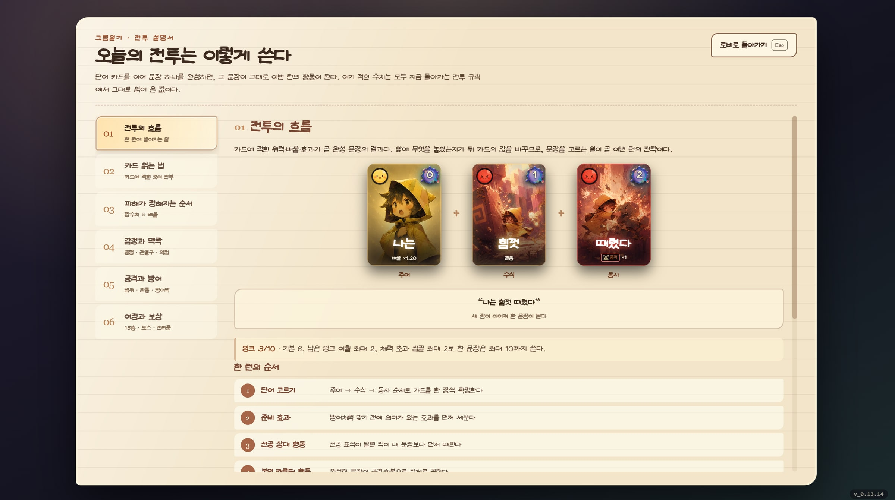
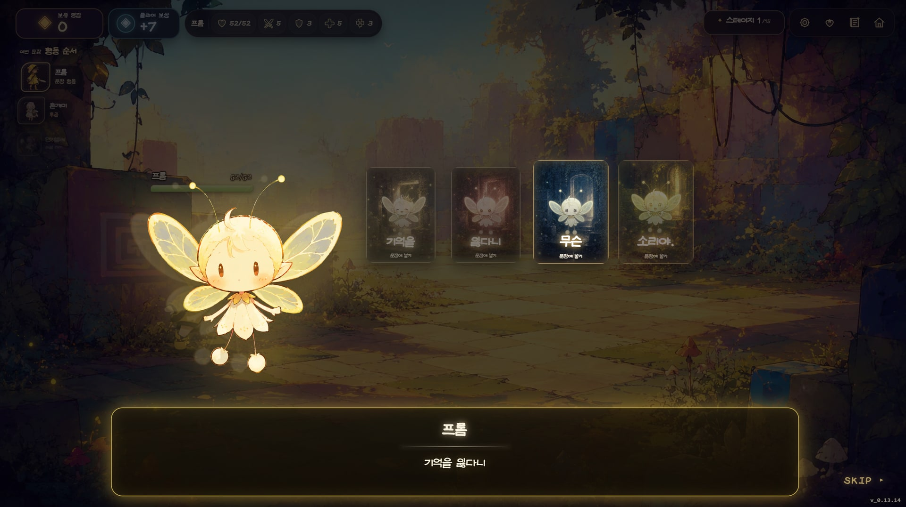
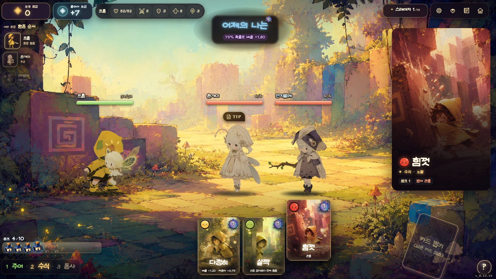
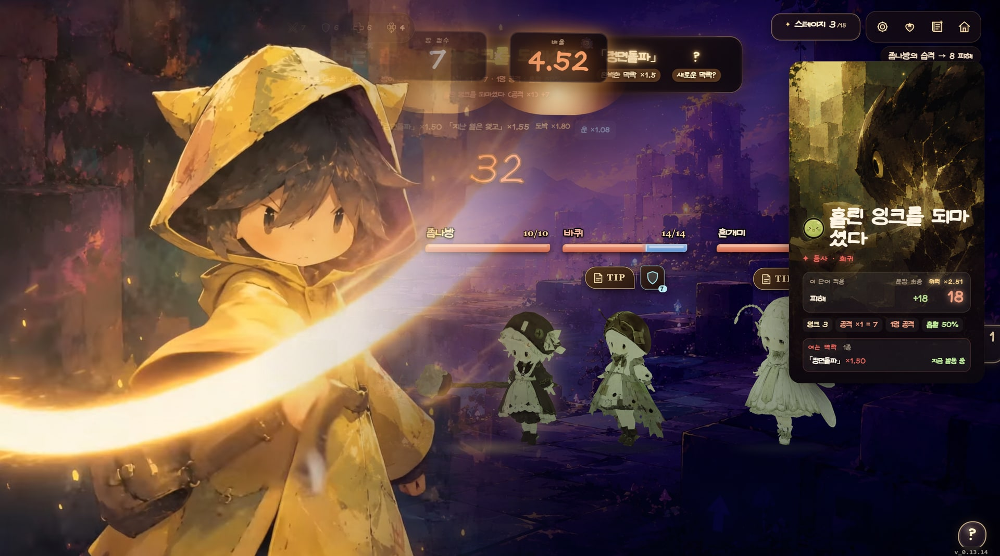
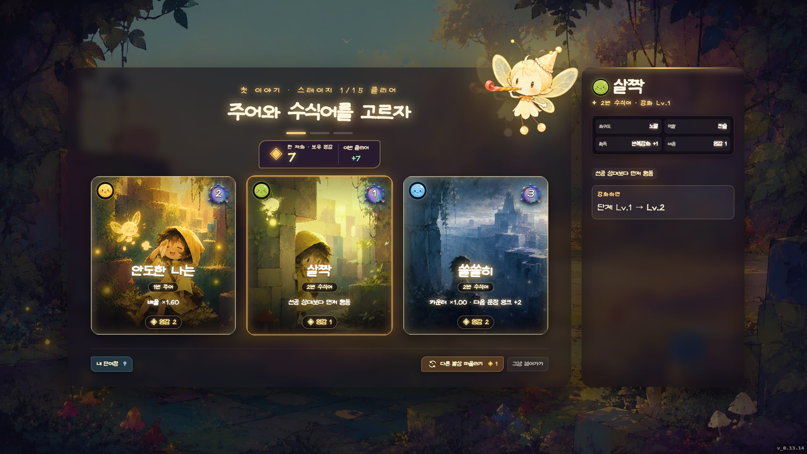
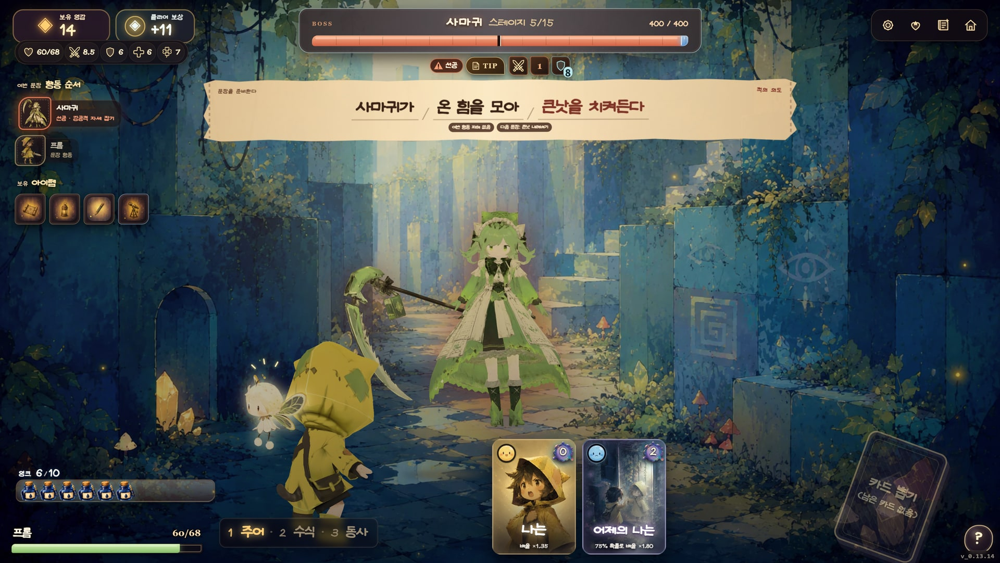

# Little Token


단어 카드를 골라 한 문장을 쓰면, 그 문장이 그대로 이번 턴의 행동이 됩니다.
**Little Token**은 소년 프롬과 요정 토큰이 망가져 가는 이야기를 고쳐 나가는
그림일기풍 단어장 덱빌딩 로그라이트입니다.

**[지금 플레이하기](https://little-token-two.vercel.app)**

- 데스크톱·모바일 웹 지원, 휴대폰은 가로 화면 권장(스크린샷은 1920×1080 기준)
- 15스테이지 구성, 5·10·15층 보스와 클리어 후 엔드리스
- 한국어·영어·일본어·러시아어·중국어 간체·번체 지원

---

## 핵심 — 단어를 모아 문장을 쓴다



전투에서는 **주어 → 수식어 → 동사** 순서로 카드를 한 장씩 고릅니다.
`나는 + 힘껏 + 때렸다`처럼 세 장을 이으면 한 문장이 되고, 마지막 카드를 고르는
순간 그 문장이 실제 행동으로 이어집니다.

- **주어**는 문장의 출발점입니다. 기본 배율이나 감정처럼 뒤에 놓일 단어의 방향을
  잡습니다.
- **수식어**는 맥락을 바꿉니다. 더 세게 때리거나, 방어를 먼저 세우거나, 행동 순서를
  뒤집기도 합니다.
- **동사**는 문장의 결말입니다. 지금까지 쌓은 수치가 공격·방어·회복 중 어떤 행동이
  될지를 정합니다.

카드의 가치는 혼자 있을 때보다 앞뒤에 무엇이 놓였을 때 드러납니다. 잘 맞는 태그를
이어 붙이면 이름 있는 **관용구**가 완성되고 큰 배율을 얻습니다. 같은 감정의 단어를
모으면 **감정 공명**이 생기고, 적의 약점 감정까지 맞히면 배율이 한 번 더 붙습니다.
어떤 조합이 왜 강해졌는지는 카드와 판정 화면에서 바로 확인할 수 있습니다.

| 맞물린 맥락 | 효과 |
|---|---|
| 같은 감정 2장 | ×1.15 |
| 같은 감정 3장 | ×1.30 |
| 이후 같은 감정 한 장 추가 | +0.15 |
| 적의 약점 감정 적중 | ×1.25 |
| 관용구 완성 | 관용구마다 정해진 배율 |

배율에는 상한이 없습니다. 감정 공명과 관용구, 아이템 효과가 겹치면 한 문장이 적
하나를 쓰러뜨리고도 남을 만큼 강해지고, 넘친 피해는 뒤에 선 적에게 이어집니다.
초반의 짧은 문장이 긴 여정 끝에 폭발적인 한 줄로 자라는 것이 이 게임의 핵심입니다.

다만 문장을 쓰려면 **잉크**가 필요합니다. 기본 잉크는 6이고, 앞 문장에서 아낀 잉크를
최대 2까지 가져올 수 있습니다. 가진 양보다 2만큼 더 써서 문장을 완성하는 것도
가능하지만, 넘겨 쓴 만큼은 체력으로 냅니다. 선택하는 동안 남은 잉크와 예상 체력
비용을 계속 보여 주므로 결과를 모르고 손해 보는 일은 없습니다.

Little Token에는 일부러 나쁜 카드를 섞어 두지 않았습니다. 실패 확률이나 자해,
부조화 패널티 대신 공격을 키울지, 먼저 방어할지, 새 관용구를 열지처럼 **어떤 이득을
고를지** 고민하게 합니다. 함께 성립할 수 없는 조합은 카드를 비활성화하고 이유를
알려 줍니다.

---

## 한 판은 이렇게 흘러갑니다

### 이야기를 만나고



오프닝에서는 주인공 **프롬**과 그의 곁을 나는 요정 **토큰**을 만납니다. 대사 속
단어가 곧바로 카드가 되고, 첫 문장을 직접 만들어 보면서 규칙을 익힙니다. 이미
플레이해 봤다면 오프닝은 건너뛸 수 있습니다.

### 한 턴에 한 문장을 쓰고



화면 아래 손패에서 카드를 고르면 슬롯이 왼쪽부터 채워집니다. 다음 선택으로 열리는
관용구, 현재 잉크, 행동 순서와 카드의 실제 수치를 모두 확정 전에 볼 수 있습니다.
방어처럼 맞기 전에 필요한 효과는 먼저 적용되고, 공격과 회복은 문장이 완성된 뒤
실행됩니다.

적의 선공 여부도 이름표와 경고 표식으로 미리 드러납니다. 빠른 적을 먼저 막을지,
수식어로 순서를 바꿀지, 피해에 집중할지를 문장을 쓰기 전에 정할 수 있습니다.

### 결과를 눈으로 확인하고



문장을 확정하면 어떤 단어와 관용구가 힘을 보탰는지 차례로 펼쳐집니다. 최종 배율과
실제 피해·방어·회복 수치가 같은 화면에 남아 있어, 잘 맞은 문장이 왜 강했는지 다음
선택에 바로 활용할 수 있습니다.

```text
「정면돌파」 ×1.50  「지난 일은 잊고」 ×1.55  도박 ×1.80  운 ×1.08
                    → 배율 4.52 → 32 피해
```

### 새 단어를 단어장에 담습니다



스테이지를 마치면 주어, 수식어·아이템, 동사 보상을 차례로 고릅니다. 새 단어는 다음
전투부터 손패에 합류하고, 이미 가진 단어를 다시 고르면 핵심 수치가 한 단계 오릅니다.
지금 모으는 감정과 어울리는지, 기존 단어 사이에 새 관용구를 만들어 주는지가 중요한
선택 기준입니다.

보상 등급은 층이 오를수록 높아집니다. 10층에서는 전설 아이템을, 15층에서는 전설
스킬 카드를 반드시 한 번 만날 수 있습니다. 아이템은 고정된 장비 수치만 받는 대신,
프롬이 감탄 문장을 붙여 그 물건이 이번 이야기에서 어떤 의미가 될지 정합니다.

### 보스의 문장도 읽어야 합니다


5·10·15층에는 저마다 다른 규칙을 가진 보스가 기다립니다. 보스는 화면 옆에서 갑자기
튀어나오지 않고 길 안쪽에서 걸어 나오며, 전용 연출과 함께 전투를 시작합니다.



보스의 다음 행동도 한 줄의 문장으로 쓰입니다.

> **사마귀가 / 온 힘을 모아 / 큰낫을 치켜든다**
>
> 이번 행동은 피해가 없지만, 다음 공격은 방어를 부수는 내려베기입니다.

지금 막아야 하는지, 먼저 공격해야 하는지, 약점을 노려 자세를 무너뜨릴지를 이 문장을
읽고 판단합니다. 체력 막, 소환, 거미줄처럼 보스마다 다른 규칙도 말풍선과 정보표에
드러나며, 클리어 뒤에는 런 결과와 엔딩, 엔드리스 모드로 이어집니다.

---

## 로컬에서 실행하기

Node.js 24.18.0 이상 25 미만과 npm 11.16.0을 사용합니다. 저장소의 `.nvmrc`와
`package.json`에도 같은 버전 범위가 적혀 있습니다.

```powershell
npm.cmd ci
npm.cmd run dev                   # 개발 서버 (localhost:3000)
npm.cmd run dev -- --mode qa      # 필수 자원 오류를 즉시 보여 주는 QA 모드
npm.cmd run dev -- --mode demo-qa # 5층까지 진행하는 데모 QA 모드
npm.cmd test                      # 타입·데이터·현지화·전투·밸런스 검사
npm.cmd run build                 # 정식 빌드 → dist/
npm.cmd run build:demo            # 5층 데모 빌드 → dist-demo/
```

출시 전 전체 검사는 아래 명령으로 돌립니다. 실제 출시는 현재 버전의 annotated 태그가
HEAD를 가리키고 작업 트리가 깨끗해야 통과합니다. 커밋 전 같은 검사를 미리 돌릴 때만
`--allow-dirty`를 붙입니다.

```powershell
npm.cmd run release:check -- --allow-dirty
```

데모판은 `.env.demo`의 `VITE_APP_EDITION=demo`를 읽어 5층 사마귀 전투에서 끝납니다.
설문 주소는 커밋하지 않는 `.env.demo.local`이나 배포 환경의 `VITE_FEEDBACK_URL`에
넣습니다. 정식판과 데모판의 저장 데이터는 서로 섞이지 않습니다.

CSV를 고친 뒤에는 `npm.cmd run data:generate`로 생성물을 갱신합니다. 개발·검사·빌드
명령에도 이 단계가 포함되어 있으므로 `src/data/generated/`는 직접 수정하지 않습니다.

## 저장소 둘러보기

```text
src/core/          문장 컴파일·검증, 잉크, 등급 예산, 런 상태
src/data/          단어, 관용구, 감정, 적, 아이템, 보상, 스테이지
src/data/csv/      단어와 관용구의 원본 CSV
src/sim/           전투 상태 변화와 적 문장 생성
src/views/         타이틀, 전투, 보상, 보스, 엔딩 화면과 연출
src/localization/  여섯 언어 번역
src/tools/         전수 검사, 보스·런 시뮬레이션
```

자주 찾는 규칙은 아래 파일에 모여 있습니다.

| 찾는 내용 | 파일 |
|---|---|
| 문장 수치와 배율 계산 | `src/core/compiler.ts` |
| 감정 공명·약점 배율 | `src/core/combatRules.ts` |
| 잉크와 초과 집필 | `src/core/ink.ts` |
| 희귀도별 성능 예산 | `src/core/budget.ts` |
| 단어의 감정 배치 | `src/data/emotions.ts` |
| 관용구 조합 | `src/data/combos.ts` |
| 관통·오버킬·보스 부위 판정 | `src/sim/reference.ts` |

문장 슬롯은 컴파일러에 고정되어 있지 않습니다. `src/data/slots.ts`의 템플릿과
패시브에 따라 칸을 늘릴 수 있고, 확장용 5슬롯 문장도 같은 구조를 사용합니다.

프로젝트의 기획 원칙과 구현 계약은 [AGENTS.md](AGENTS.md), 현재 전투 규칙은
[SENTENCE_COMBAT_SPEC.md](SENTENCE_COMBAT_SPEC.md)에 정리되어 있습니다. 앞으로의 작업은
[ROADMAP.md](ROADMAP.md), 버전별 변경 기록은 [VERSION.md](VERSION.md)에서 볼 수 있습니다.
